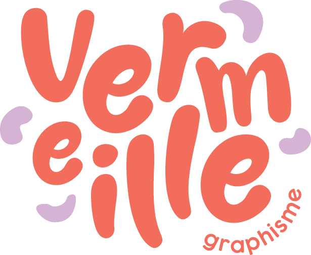

<div align="center">



### Portfolio de **Vermeille Pontoire** — graphiste

Sitio web de una sola página: identidades visuales, print, ilustración y fotografía.

`HTML` · `CSS` · `JavaScript vanilla` · sin dependencias

</div>

---

## ✨ Qué incluye

| | |
|---|---|
| 🎬 **Hero animado** | blobs orgánicos con parallax y retrato circular |
| 🗓️ **Parcours** | timeline con pestañas *Formation* / *Expérience* |
| 🖼️ **Portfolio** | grid masonry con filtros por categoría |
| 🎠 **Carrusel** | galería de cada proyecto en un marco fijo (`object-fit: contain`), con flechas, puntos, teclado y swipe |
| 📱 **Responsive** | menú burger, breakpoints 860 / 620 / 540 px y `prefers-reduced-motion` |

## 🎨 Identidad

| Rol | Valor |
|---|---|
| Coral principal | `#F18B6F` |
| Coral oscuro | `#B84A34` |
| Lavanda | `#B7A4F0` |
| Crema (fondo) | `#FBF3EA` |
| Tinta | `#2A211C` |

**Tipografías** — Scandia y Sofia Pro son de licencia comercial, así que se usan las alternativas libres más parecidas:

| Uso | Original | Usada |
|---|---|---|
| Títulos principales y footer | Scandia | **Hanken Grotesk** |
| Subtítulos y títulos de proyecto | Sofia Pro | **Nunito Sans** |
| Manuscrita del logo | — | **Gluten** |
| Texto corrido | — | **Poppins** |

### Cambiar una tipografía

Solo hay que tocar dos sitios:

1. El `<link>` de Google Fonts en [`index.html`](index.html) (cabecera).
2. La variable correspondiente en `:root` de [`css/style.css`](css/style.css) — `--font-display`, `--font-subtitle`, `--font-script` o `--font-body`.

Si la fuente es de pago o local, súbela a `assets/fonts/` y declara un `@font-face` en lugar del `<link>`.

## 📁 Estructura

```
vermeille-portfolio/
├── index.html            # marcado de todas las secciones
├── css/style.css         # design system + componentes
├── js/
│   ├── projects-data.js  # PROJECTS y TIMELINE (contenido editable)
│   └── main.js           # loader, reveal, filtros, modal, carrusel
└── assets/img/           # portadas, galerías y logos
```

## 🚀 Uso

Abre `index.html` en el navegador, o levanta un servidor local:

```bash
python -m http.server 8000
```

Para añadir un proyecto, basta con crear una entrada nueva en `PROJECTS` (`js/projects-data.js`); el grid y el carrusel se generan solos.

---

<div align="center">
<sub>© 2026 Vermeille Pontoire — Graphiste</sub>
</div>
